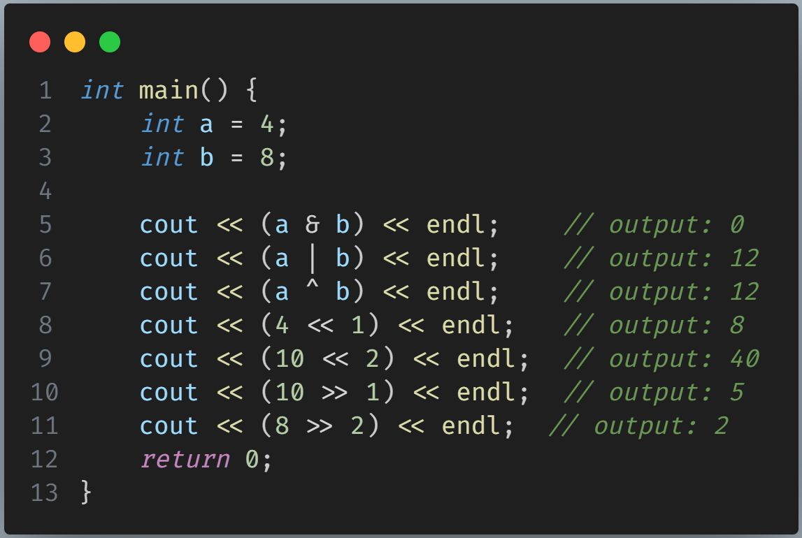
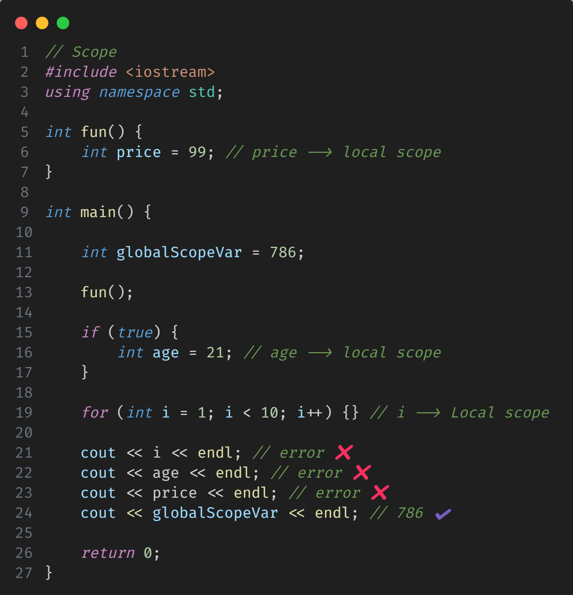

# DSA using C++

## Chapter 1 - Flowchart & Pseudocode

- Flowchart
- Pseudocode
- C++ installation

## Chapter 2 - Variable, Datatypes & Operators

## Chapter 3 - Conditionals & Loops

## Chapter 4 - Patterns

## Chapter 5 - Functions

## Chapter 6 - Binary Number System

### How to convert Decimal to Binary?

#### 1st Method:

- First you need to divide your decimal by 2 until it can't be divisible anymore.
- Second, you have to arrange the remainders from bottom to top, and it gives you the binary form of the decimal. For clarity, look at the bellow examples:

<figure>
    
    <figcaption><i>Decimal to binary from 1 - 10</i></figcaption>
</figure>

#### 2nd Method:

- For more clarity look at the bellow picture. just remember that we should always choose a limit which is less than our Decimal number, like I have choosen 32 or 2<sup>5</sup>, which is less than our Decimal number 37.

<figure>
    
    <figcaption><i>Decimal to binary - 37 & 17</i></figcaption>
</figure>

### How to convert Binary to Decimal?

- we have only have one way of doing it and that is the original mathematical way. Look at the bellow example for more clarity which converts binary (<code>101010</code>) to decimal.

<figure>
    
    <figcaption><i>Binary to Decimal conversion</i></figcaption>
</figure>

### Two's complement

<code>we use Two's complement to store negative value to the memory.</code>
For calculating Two's complement of a number we do the following steps:

- Convert the number to Binary form.
- Prefix the Binary form with a zero (0).
- <b><code>One's complement</code></b> -> in the Binary, replace 0s with 1 and 1s with 0.
- Add 1 to the Binary.

Let's look this steps in an example

<figure>
    
    <figcaption><i>Two's complement of a number (-10)</i></figcaption>
</figure>

<b>Now, let's change the Two's complement of a number to it's original Decimal number.</b>

- First, check the sign of a binary.
  - (-): If it starts with 1, it's negative in decimal.
  - (+): If it starts with 0, it's positive in decimal.
- Second, take out it's one's complement.
  - 0 ---> 1
  - 1 ---> 0
- Finally, add 1 to the binary.
<figure>
    
    <figcaption><i>  - Change negative Binary (10110) to Decimal number</i></figcaption>
</figure>

Now let's solve a question regarding Two's complement and it's vice versa. <br>
Qs: Convert -8 to Binary and reverse.

<figure>
    
</figure>

// HomeWork <br>
<b>Qs: Convert -12 to binary & reverse ?</b>

<code>&nbsp;-12</code> <br>

- 1100
- 01100
- 10011
- 10011 + 1 = <code>10100</code>
  <br>finally : &nbsp; <code>(-12)<sub>10</sub> = (10100)<sub>2</sub></code>

<br> <b>Let's make it reverse:</b>

- <code>10100</code>
- 01011
- 01011 + 1 = <code>01100</code>
- <code>(1100)<sub>2</sub> = (12)<sub>10</sub></code>
  <br> Because, <code>10100</code> starts with 1 so it's decimal form has a negative sign <code>(-12)<sub>10</sub></code> <br>
  <code>(1100)<sub>2</sub> = (-12)<sub>10</sub></code>

## Chapter 7 - Bitwise operators, Scope, Datatype modifiers

### Bitwise Operators

- AND ( & )
- OR ( | )
- XOR ( ^ ) --> (Exclusive OR)
- Left Shift operator (<<)
- Right Shift operator (>>)

Let's have a look to some examples:

<figure>
    
</figure>

### Operators precedence

- look at the following chart:
<figure>
    
</figure>

- Let's have a look to an example of <code>operator precedence</code>:
<figure>
    
</figure>

### Scope

<b><code>Scope</code></b> is the area in a program where a variable is accessible. It determines where the variable can be used, whether inside a function (local scope) or throughout the entire program (global scope).

- <b><code>Local scope</code></b>: Variables declared within a function or block can only be accessed within that specific function or block.
- <b><code>Global scope</code></b>: Variables declared outside of all functions or blocks can be accessed from anywhere in the program.

Examples for scope:

<figure>
    
</figure>

### Datatype modifiers

Modifiers are used to alter the size or range of data types to suit different use cases.

- <b><code>long</code> (>= 4bytes)</b> : Used to store values larger than the typical size for int. It guarantees at least 4 bytes of storage.
    ```
    long int population = 790000000;
    ```

- <b><code>Short</code> (<= 2bytes)</b> : Used when you need to store small values and want to save memory. Common for values like age, where 2 bytes are sufficient. 
    ```java
    short int age = 21;
    ```

- <b><code>long long</code> (≥ 8 bytes)</b> : Used to store very large values that exceed the range of long, like populations of entire countries or global figures.
    ```java
    long long population = 7800000000;
    ```

- <b><code>Signed</code></b> : Specifies that a value can be either positive or negative. By default, int types are signed, so this is typically implicit unless you need to make it clear.
    ```java
    signed int temperature = -5; // Allows negative values
    ```

- <b><code>Unsigned</code></b> - Used when a value can only be non-negative, like IDs or counts. It extends the range of positive numbers since no space is used for storing negative values.
    ```java
    unsigned int customerId = 1202
    ```

