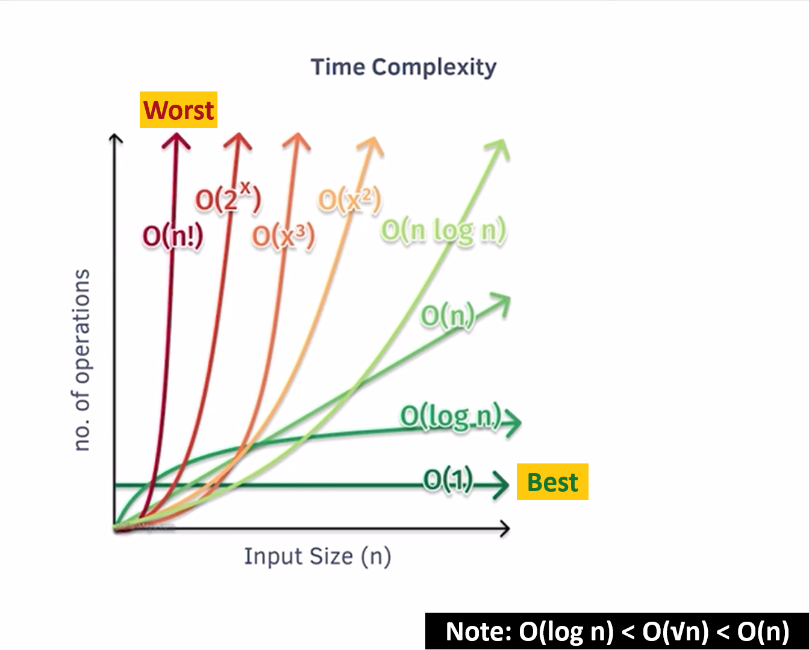

# Time Complexity Comparisons

## 1. Is O(√n) better than O(n)?

Yes, O(√n) is better than O(n) because √n grows slower than n as the input size increases. For example:

- If n = 100, O(√n) would involve approximately 10 steps (√100 = 10), while O(n) would involve 100 steps.

As n increases, the difference between √n and n becomes more pronounced, making O(√n) more efficient.

---

## 2. Which is better: O(√n) or O(log n)?

O(log n) is better than O(√n). This is because logarithmic growth is much slower than square root growth. For large input sizes, O(log n) remains significantly smaller than O(√n). For example:

- If n = 1,000,000, O(√n) involves about 1,000 steps, while O(log n) (in base 2) involves around 20 steps.
  
So, O(log n) is more efficient for large inputs.

---

## Time Complexity Graph

Here’s a visual representation of various time complexities:

---

**Summary:**  
O(log n) < O(√n) < O(n)
