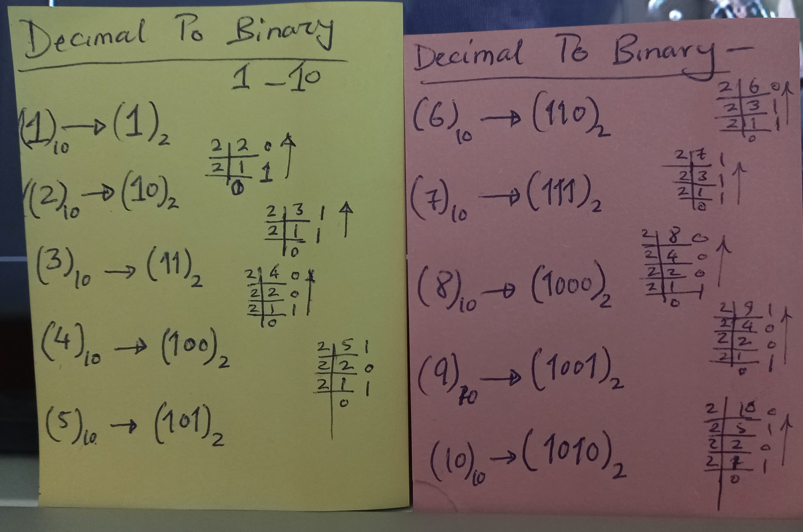
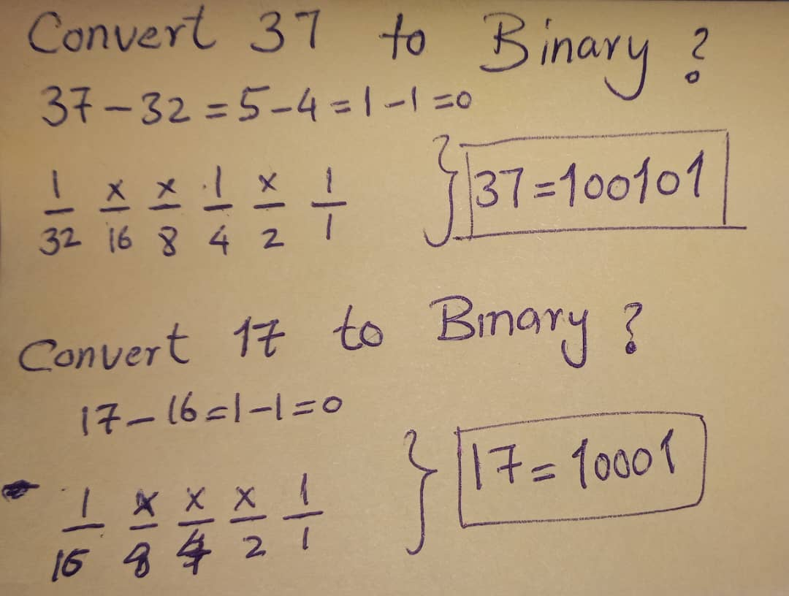

## Note
### How to convert Decimal to Binary?

#### 1st Method:

- First you need to divide your decimal by 2 until it can't be divisible anymore.
- Second, you have to arrange the remainders from bottom to top, and it gives you the binary form of the decimal. For clarity, look at the bellow examples:

<figure>
    
    <figcaption><i>Decimal to binary from 1 - 10</i></figcaption>
</figure>

#### 2nd Method:
- For more clarity look at the bellow picture. just remember that we should always choose a limit which is less than our Decimal number, like I have choosen 32 or 25, which is less than our Decimal number 37. 

<figure>
    
    <figcaption><i>Decimal to binary - 37 & 17</i></figcaption>
</figure>

### How to convert Binary to Decimal?
- we have just one way to do it and that is the original mathematical way.

<figure>
    
    <figcaption><i>Binary to Decimal conversion</i></figcaption>
</figure>
